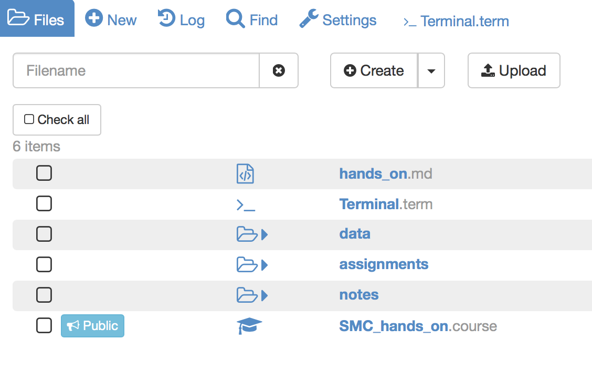

# Hands on session
This tutorial is intended to help lecturers set up a basic course in SageMathCloud.  It is based on the the SMC tutorial developed by the [RSE team @ Sheffield](http://rse.shef.ac.uk).

For advanced features please refer to the relevant sections in this tutorial or contact the staff at SageMathCloud directly  at help@sagemath.com  

## Getting you started
1. Create an account in [SageMathCloud](https://cloud.sagemath.com/) using your institutional email.
- Log into your SageMathCloud account and create a new project named **SMC_hands_on** and make sure you add a meaningful description.
- Once you have created your project the next thing to do is create a **.course** file (you can name it SMC_hands_on.course as well).

## Structuring your course
A commonly used structure for SMC courses is as follows:
  - notes
    - week1
  - data
    - data set 1
  - assignments
    - week1
    - week2
  - lab_sessions (if applicable)

(Note this is a suggested basic structure, which has been proved to be useful for some people. You can always add directories to satisfy your needs e.g. supplementary material, demo codes, etc.).

Now let's start populating your course with some content.

If you have Internet access in your SageMathCloud account (upgraded account) follow the next steps:

1. Create a terminal session (**>_Terminal**), you can give it whatever name you want.
- We have created a GitHub repository for this session, which contains some directories and files to populate your project. In your terminal checkout the repo:
`git clone https://github.com/trallard/SMC_HandsOn.git`

Once you have done this your project should look something similar to this:

If you don't have internet access you can clone the repository on your personal computer and then drag and drop the files into your SageMathCloud project.

Note that the drag and drop functionality has a size limit so you might need to create your project directories first. You can do this by using the **New** button or typing directly the terminal commands:

`mkdir notes`

`mkdir notes/week1`
