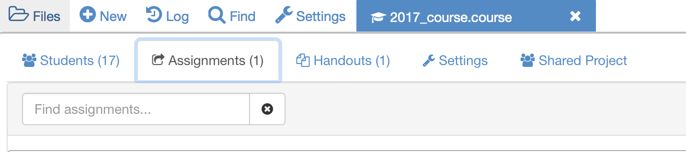

# Assigning coursework to the students
In this section  you will learn how to create assignments and assign them to students.

If you navigate to your `.course` file you should now be able to see the students in your course as well as the following upper banner:

You will notice that you have assignments as well as handouts. Both consist on a folder that contains at least one file to be distributed to your students.

The main difference relies on the actions you and students can perform on the files:

* Handouts: these include the lecture material (notes) and are meant to be accesses by the students at any point during the course

* Assignments: these cover the coursework/projects students will be working on and which you will be collecting and marking

## Exercise: sharing notes
In your `.course` file go to **Handouts** and  
